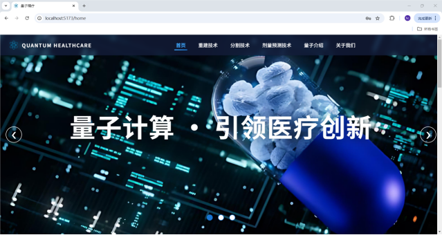
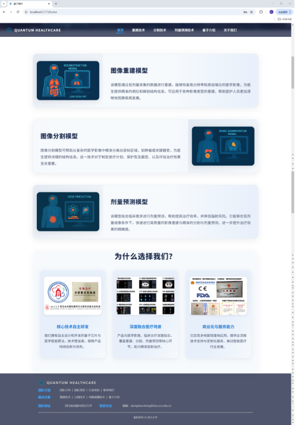
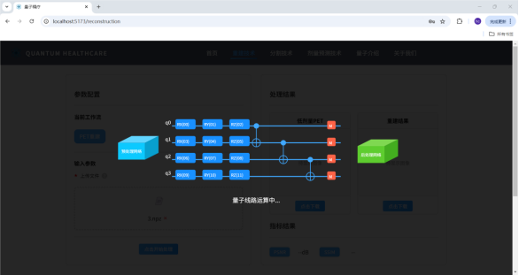
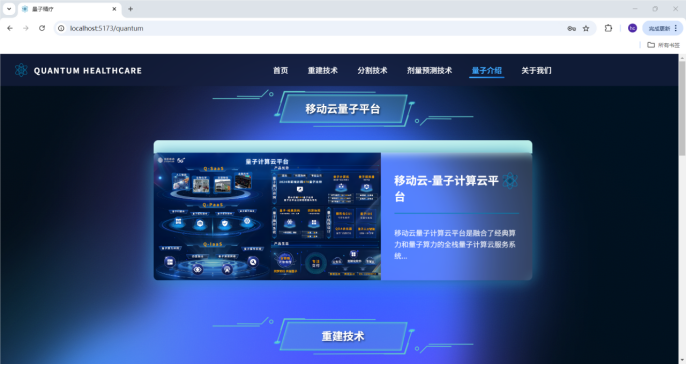
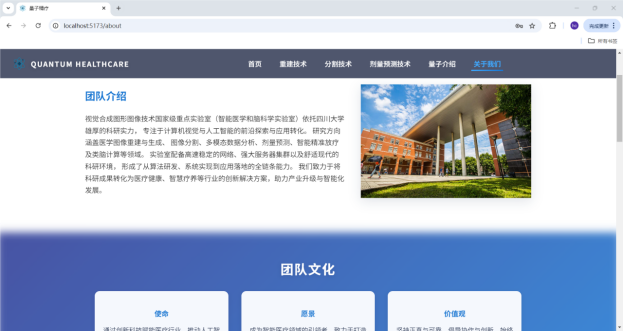

# QUANTUM HEALTHCARE

本系统基于移动云五岳量子机器学习平台开发，能够同时完成放疗中的重建、分割及剂量预测三大任务，实现一体化管理与分析。

## 推荐的开发环境配置

[VSCode](https://code.visualstudio.com/) + [Volar](https://marketplace.visualstudio.com/items?itemName=Vue.volar) (and disable Vetur).

## 自定义配置

请参考 [Vite Configuration Reference](https://vite.dev/config/).

## 项目安装（前端）

```sh
npm install
```

### 开发环境编译与加载

```sh
npm run dev
```

### 生产环境编译与压缩

```sh
npm run build
```

## 项目安装（后端）

```sh
请进入./src/backend
```

## 依赖安装
```sh
pip install flask flask-cors paramiko opencv-python scikit-image numpy
```

## 后端运行
```sh
python app.py
```
## 系统部分截图







## 注意！！！
```sh
./src/backend/app.py中的
SSH_HOST = "xxx"
SSH_PORT = xxx
SSH_USER = "xxx"
SSH_PASSWORD = "xxx"
为我们租借服务器的信息，如需后端连接服务器运行模型推理，请联系我们：xionghaocheng@stu.scu.edu.cn
```